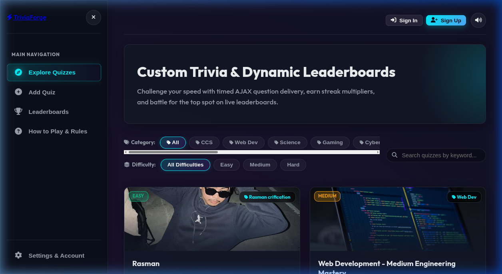
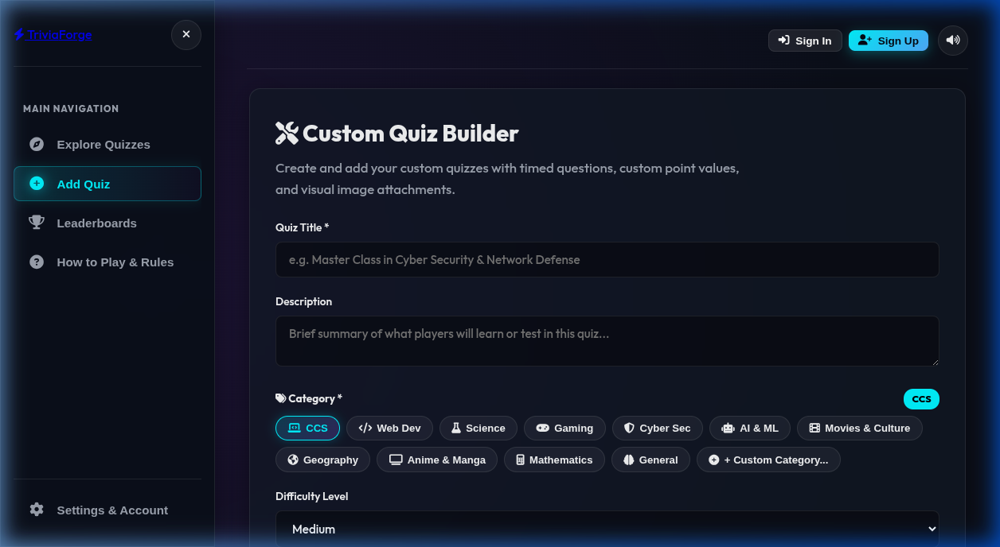
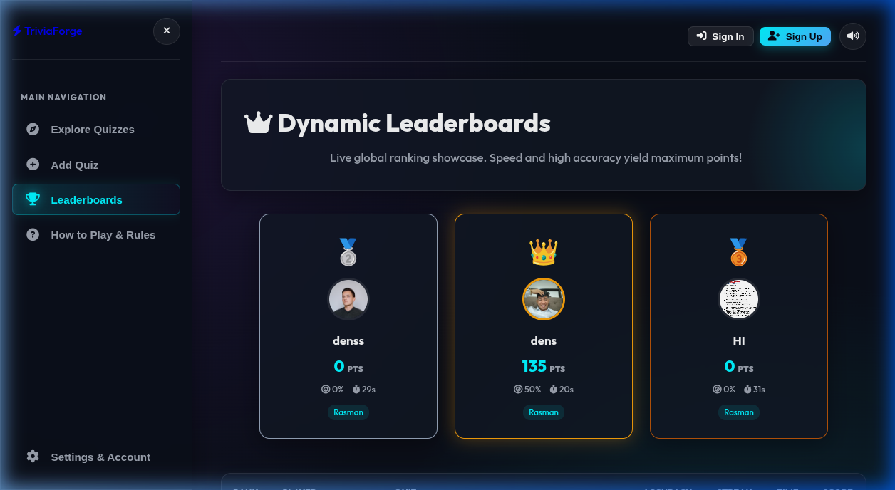
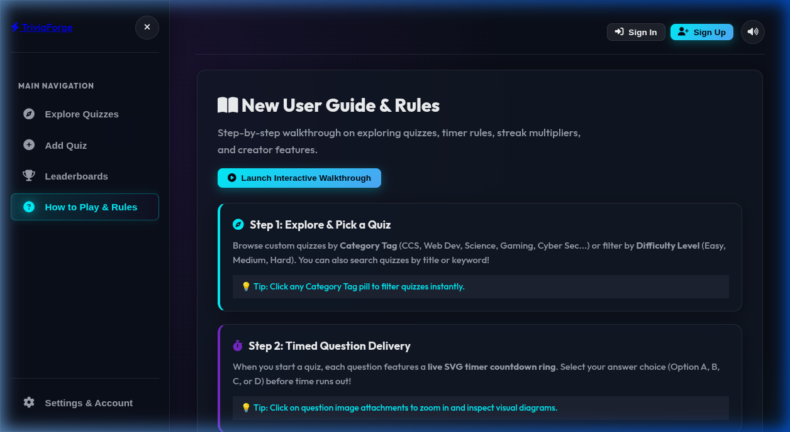
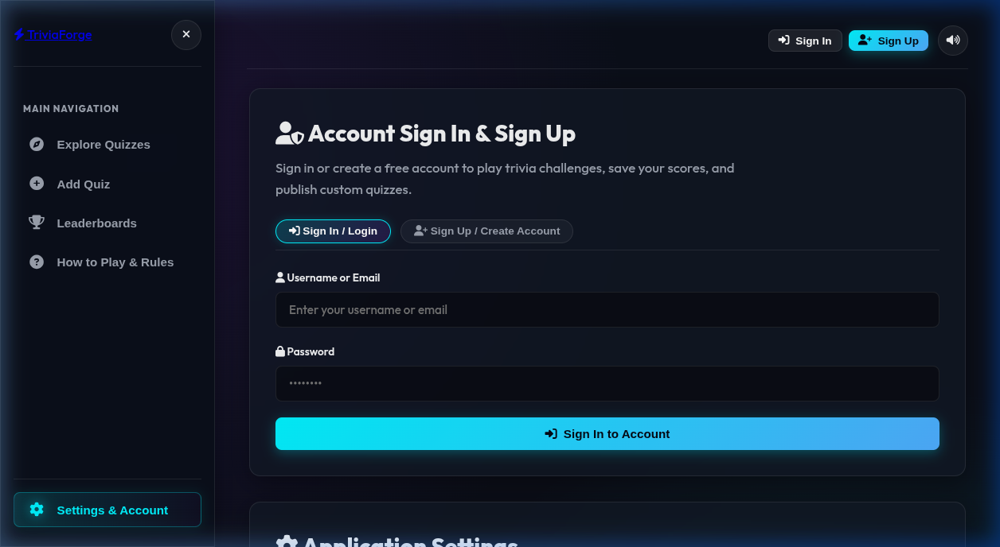

# ⚡ TriviaForge

> **Custom Trivia Quiz Maker & Dynamic Leaderboards**  
> Create timed trivia quizzes, compete in real-time challenges, earn streak multipliers, and battle for the top spot on live leaderboards.

---

## 📋 Table of Contents

- [Overview](#overview)
- [Features](#features)
- [Tech Stack](#tech-stack)
- [Project Structure](#project-structure)
- [Database Schema](#database-schema)
- [Setup & Installation](#setup--installation)
- [Configuration](#configuration)
- [API Reference](#api-reference)
- [Usage Guide](#usage-guide)

---

## Overview

**TriviaForge** is a full-stack web application built as a Single Page Application (SPA) running on **PHP + MySQL via XAMPP/LAMPP**. Users can register, create custom trivia quiz sets, play timed question challenges, and compete on a global leaderboard — all without page reloads.

---

## ✨ Features

### 🧩 Quiz Management
- Browse all published quizzes with category and difficulty filters
- Search quizzes by keyword
- Create custom quizzes with multiple-choice questions
- Add per-question image URLs, explanations, and point values
- Edit or delete your own published quizzes
- Bulk import quizzes via JSON format
- Category system: CCS, Web Dev, Science, Gaming, Cyber Sec, AI & ML, and more

### 🎮 Gameplay
- Timed questions (configurable seconds per question)
- Real-time countdown timer per question
- Streak multiplier system — consecutive correct answers boost your score
- Automatic score calculation and accuracy tracking
- 1-hour quiz cooldown to prevent score farming
- Answer explanations shown after each question

### 👤 User Accounts
- Register / Sign In / Sign Out
- Update display name and profile picture (URL or upload)
- Choose from preset avatar gallery
- Change account password securely
- View personal stats: Total Points, Quizzes Played, Average Accuracy
- View recent quiz history (last 5 plays)
- Delete account permanently

### 🏆 Leaderboard
- Global leaderboard ranked by score
- Per-quiz leaderboard entries
- Player avatar, name, score, accuracy, time, and max streak shown

### ⚙️ Settings
- Dark / Light / System theme mode
- Toggle sound effects
- Set preferred default question timer
- Clear local storage cache
- Log out directly from Settings

---

## 🛠 Tech Stack

| Layer | Technology |
|---|---|
| Frontend | HTML5, Vanilla CSS, Vanilla JavaScript (ES6 Classes) |
| Backend | PHP 8.2 (no framework) |
| Database | MySQL / MariaDB (via XAMPP/LAMPP) |
| Web Server | Apache 2.4 (via XAMPP/LAMPP) |
| Fonts | Google Fonts — Inter, Outfit |
| Icons | Font Awesome 6.4 |
| Images | Unsplash (CDN, no API key needed) |

---

## 📁 Project Structure

```
Trivi_Quiz/
│
├── index.php               # Main SPA entry point (all tabs rendered here)
├── schema.sql              # Full database schema + seed data
├── .env                    # Environment variables (DB credentials, app config)
│
├── api/                    # PHP REST API endpoints
│   ├── auth.php            # Register, login, logout, session check
│   ├── create_quiz.php     # Create and update quizzes + questions
│   ├── db.php              # PDO database connection factory
│   ├── leaderboard.php     # Fetch global and per-quiz leaderboards
│   ├── profile.php         # Get/update profile, stats, password, delete account
│   ├── question.php        # Fetch questions for a quiz
│   ├── quizzes.php         # List quizzes, quiz details, delete quiz
│   ├── submit_answer.php   # Submit quiz result to leaderboard
│   ├── upload.php          # Image upload handler
│   ├── seed_more.php       # Seed script for sample quizzes & questions
│   └── clean_duplicates.php# Utility to clean duplicate leaderboard entries
│
├── config/
│   └── db_config.php       # Loads .env and defines DB_* constants
│
├── css/
│   └── styles.css          # Full design system: tokens, components, animations
│
├── js/
│   ├── app.js              # Main SPA controller, router, cooldown ticker
│   ├── auth.js             # Auth manager: login, register, profile CRUD, UI
│   ├── creator.js          # Quiz builder: create, edit, import JSON
│   ├── player.js           # Quiz player: timer, scoring, streak, results screen
│   ├── leaderboard.js      # Leaderboard fetching and rendering
│   ├── tutorial.js         # Help tab and interactive tutorial walkthrough
│   └── audio.js            # Sound effects manager
│
└── uploads/                # User-uploaded profile pictures
```

---

## 🗄 Database Schema

### `users`
| Column | Type | Description |
|---|---|---|
| `id` | INT PK | Auto-increment user ID |
| `username` | VARCHAR(50) UNIQUE | Display name |
| `email` | VARCHAR(100) UNIQUE | Email address |
| `password_hash` | VARCHAR(255) | bcrypt hashed password |
| `avatar_icon` | TEXT | Avatar image URL |
| `created_at` | TIMESTAMP | Account creation time |

### `quizzes`
| Column | Type | Description |
|---|---|---|
| `id` | INT PK | Auto-increment quiz ID |
| `user_id` | INT FK | Creator's user ID |
| `title` | VARCHAR(255) | Quiz title |
| `description` | TEXT | Quiz description |
| `category` | VARCHAR(100) | Category label |
| `difficulty` | ENUM(Easy,Medium,Hard) | Difficulty level |
| `banner_url` | TEXT | Cover image URL |
| `time_per_question` | INT | Seconds per question |
| `created_at` | TIMESTAMP | Creation timestamp |

### `questions`
| Column | Type | Description |
|---|---|---|
| `id` | INT PK | Auto-increment question ID |
| `quiz_id` | INT FK | Parent quiz ID |
| `question_text` | TEXT | The question body |
| `image_url` | TEXT | Optional image for the question |
| `option_a/b/c/d` | VARCHAR(255) | Multiple choice options (A–D) |
| `correct_option` | INT | Index of correct answer (1=A, 2=B, 3=C, 4=D) |
| `points` | INT | Points awarded for correct answer |
| `explanation` | TEXT | Shown after answering |

### `leaderboard`
| Column | Type | Description |
|---|---|---|
| `id` | INT PK | Auto-increment entry ID |
| `quiz_id` | INT FK | Quiz played |
| `user_id` | INT FK | User who played (nullable for guests) |
| `player_name` | VARCHAR(100) | Display name at time of play |
| `score` | INT | Total score earned |
| `accuracy` | FLOAT | Percentage of correct answers |
| `total_time` | INT | Total seconds taken |
| `streak_max` | INT | Longest answer streak |
| `created_at` | TIMESTAMP | Play timestamp |

---

## 🚀 Setup & Installation

### Prerequisites
- **XAMPP** or **LAMPP** with Apache + MySQL running
- PHP 8.0 or higher
- A web browser

### Steps

1. **Clone or copy the project** into your XAMPP/LAMPP web root:
   ```bash
   # LAMPP (Linux)
   cp -r Trivi_Quiz /opt/lampp/htdocs/

   # XAMPP (Windows)
   # Copy to C:\xampp\htdocs\Trivi_Quiz\
   ```

2. **Start Apache and MySQL** in XAMPP/LAMPP:
   ```bash
   # Linux
   sudo /opt/lampp/lampp start
   ```

3. **Import the database schema** (auto-initializes on first load, or manually):
   ```bash
   /opt/lampp/bin/mysql -u root < /opt/lampp/htdocs/Trivi_Quiz/schema.sql
   ```
   > The app auto-creates the database and tables on the very first page load via `api/db.php`.

4. **Configure your `.env`** file (see [Configuration](#configuration) below).

5. **Open in your browser:**
   ```
   http://localhost/Trivi_Quiz/
   ```

6. *(Optional)* **Seed sample data** by visiting:
   ```
   http://localhost/Trivi_Quiz/api/seed_more.php
   ```

---

## ⚙️ Configuration

Edit the `.env` file in the project root:

```env
# Database Credentials (MySQL / MariaDB)
DB_HOST=127.0.0.1
DB_PORT=3306
DB_NAME=trivia_quiz_db
DB_USER=root
DB_PASS=

# Application Settings
APP_ENV=development
APP_PORT=8005
```

> **Note:** Leave `DB_PASS` empty if your XAMPP/LAMPP MySQL has no root password (default).

---

## 📡 API Reference

All endpoints are in the `api/` directory and return **JSON**.

| Endpoint | Method | Description |
|---|---|---|
| `api/auth.php?action=session` | GET | Check current login session |
| `api/auth.php?action=login` | POST | Log in with username/password |
| `api/auth.php?action=register` | POST | Register a new account |
| `api/auth.php?action=logout` | POST | Log out and destroy session |
| `api/quizzes.php` | GET | List all quizzes (with filters) |
| `api/quizzes.php?id={id}` | GET | Get single quiz + questions |
| `api/quizzes.php?action=delete` | POST | Delete a quiz (owner only) |
| `api/create_quiz.php` | POST | Create a new quiz |
| `api/create_quiz.php?action=update` | POST | Update existing quiz |
| `api/question.php?quiz_id={id}` | GET | Get questions for a quiz |
| `api/submit_answer.php` | POST | Submit quiz result to leaderboard |
| `api/leaderboard.php` | GET | Fetch global or per-quiz leaderboard |
| `api/profile.php?action=get` | GET | Get profile, stats, history |
| `api/profile.php?action=update_profile` | POST | Update username / avatar |
| `api/profile.php?action=update_password` | POST | Change account password |
| `api/profile.php?action=delete_account` | POST | Permanently delete account |
| `api/upload.php` | POST | Upload image file |

---

## 📖 Usage Guide

### Playing a Quiz
1. Go to **Explore Quizzes** from the sidebar
2. Filter by **Category** or **Difficulty**
3. Click **Play** on any quiz card
4. Answer each question before the timer runs out
5. Earn bonus points for answer streaks
6. View your score, accuracy, and rank on the results screen

### Creating a Quiz
1. Click **Add Quiz** in the sidebar (must be logged in)
2. Fill in title, description, category, difficulty, and timer
3. Add questions: type the question, fill in 4 options, mark the correct one
4. Optionally add image URLs and explanations per question
5. Click **Publish Quiz**

### Managing Your Account
1. Click **Settings & Account** in the sidebar
2. **Not logged in?** — Sign In or Sign Up inline on the Settings page
3. **Logged in?** — Edit profile, change password, view stats, manage quizzes, and **Log Out** at the bottom of the page

---

## 👥 Authors

Built by the **TriviaForge Team** as a full-stack PHP + MySQL + Vanilla JS web application.

---

## 📄 License

This project is for educational and personal use. Feel free to fork and customize.

---

## 🖼 Screenshots

### Explore Quizzes
Browse and filter all published quizzes by category and difficulty.




---

### Custom Quiz Builder
Create custom quizzes with timed questions, categories, difficulty levels, and image attachments.



---

### Dynamic Leaderboards
Live global ranking showcase. Speed and high accuracy yield maximum points.



---

### How to Play & Rules
Step-by-step guide covering explore, timed delivery, streaks, bonuses, and creator features.



---

### Settings & Account
Sign In / Sign Up inline, manage profile, change appearance theme, and log out.


